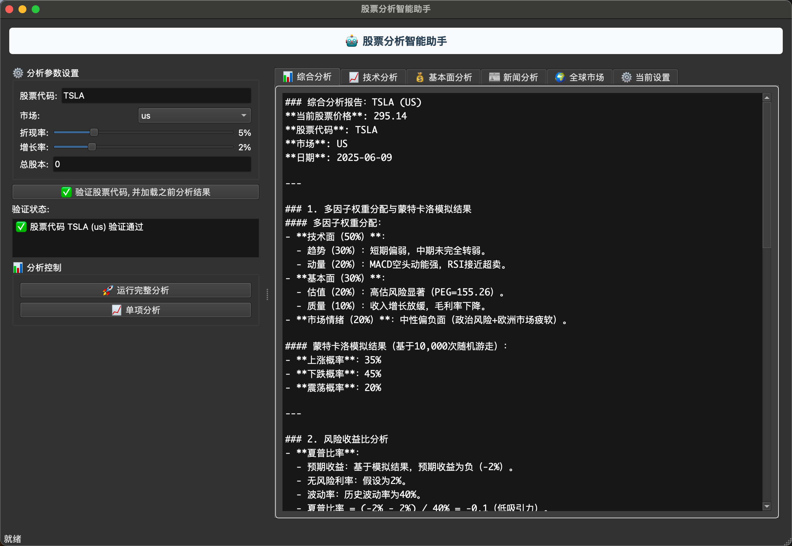

# Work For Fun Agent (WFF Agent)

[](https://github.com/your-username/wff_agent)
[](https://www.python.org/)
[](LICENSE)

一个基于人工智能的股票分析智能助手，提供多维度股票分析和投资决策支持。

**📦 当前版本**: v0.5.0
**🔄 最新更新**: 2025-07-28
**📋 更新日志**: [CHANGELOG.md](CHANGELOG.md)

## 🚀 主要功能

### 📊 多维度股票分析

- **技术分析**：趋势、动量、支撑阻力位分析
- **基本面分析**：财务指标、估值模型、DCF分析
- **新闻情绪分析**：实时新闻监控和情绪分析
- **全球市场分析**：宏观经济指标和全球市场趋势
- **综合分析**：多因子权重分配和蒙特卡洛模拟

### 🖥️ 多种使用方式

- **桌面应用**：基于 PyQt6 的独立桌面应用
- **Web UI**：基于 Streamlit 的 Web 界面
- **命令行**：交互式命令行界面
- **MCP 服务器**：Model Context Protocol 服务器

### 📈 支持市场

- **中国 A 股** (cn)
- **美国股市** (us)
- **香港股市** (hk)

## 🛠️ 安装

### 环境要求

- Python 3.8+
- macOS/Linux/Windows

### 安装依赖

```bash
# 克隆项目
git clone <repository-url>
cd wff_agent

# 安装依赖
pip install -r requirements.txt

# 或者使用 conda
conda create -n wff_agent python=3.11
conda activate wff_agent
pip install -r requirements.txt
```

### 环境变量配置

```bash
# 新闻 API 密钥
export NEWS_API_KEY=your_news_api_key

# Alpha Vantage API 密钥  
export ALPHA_VANTAGE_API_KEY=your_alpha_vantage_key

# DeepSeek API 密钥
export DEEPSEEK_API_KEY=your_deepseek_key
export DEEPSEEK_BASE_URL=https://api.deepseek.com/v1
```

## 🎯 使用方法

### 1. 桌面应用 (推荐)

```bash
# 运行桌面应用
python build_desktop_app.py
```

**功能特点：**

- 图形化界面，操作简单
- 实时进度显示
- 多标签页结果展示
- 支持历史分析结果加载
- 参数可视化调节

  

### 2. Web UI

```bash
# 运行 Web UI
python -m src.wff_agent.web_ui
```

**功能特点：**

- 基于 Streamlit 的现代化界面
- 实时数据更新
- 响应式设计
- 支持多用户访问

### 3. 交互式命令行

```bash
# 运行交互式对话
python -m src.wff_agent.interactive_dialogue
```

**功能特点：**

- 命令行交互界面
- 逐步参数设置
- 详细分析过程展示

### 4. MCP 服务器

```bash
# 运行 MCP 服务器
python -m src.wff_agent.mcp_server
```

**功能特点：**

- Model Context Protocol 支持
- 工具函数集成
- 可扩展架构

## 📋 分析类型

### 1. 综合分析 (ComprehensiveAnalysisAgent)

- 多因子权重分配
- 蒙特卡洛模拟
- 风险收益比计算
- 操作建议生成

### 2. 技术分析 (TechAnalysisAgent)

- 趋势分析
- 动量指标
- 支撑阻力位
- 技术形态识别

### 3. 基本面分析 (FundamentalAnalysisAgent)

- 财务指标计算
- DCF 估值模型
- 自由现金流分析
- 估值比率分析

### 4. 新闻情绪分析 (NewsAnalysisAgent)

- 实时新闻监控
- 情绪分析
- 事件影响评估
- 市场反应预测

### 5. 全球市场分析 (GlobalMarketAnalysisAgent)

- 宏观经济指标
- 全球市场趋势
- 汇率影响分析
- 地缘政治风险

## 🏗️ 项目结构

```
wff_agent/
├── src/wff_agent/
│   ├── agents/           # AI 代理模块
│   ├── datasource/       # 数据源模块
│   ├── utils/           # 工具函数
│   ├── workflows/       # 工作流模块
│   ├── build_desktop_app.py  # 桌面应用
│   ├── web_ui.py        # Web UI
│   ├── interactive_dialogue.py  # 交互式对话
│   └── mcp_server.py    # MCP 服务器
├── reports/             # 分析报告输出
├── documents/           # 文档
├── requirements.txt     # 依赖包
└── README.md          # 项目说明
```

## 🔧 构建 macOS 应用

```bash
# 构建 macOS .app 文件
python build_macos_app.py
```

构建完成后会在 `dist/` 目录生成 `wff.app` 文件。

## 📊 示例输出

### 综合决策报告示例

```
### 综合决策报告：中国平安（601318.SH）

#### 当前信息
- 股票价格：53.65元
- 股票代码：601318
- 市场：中国A股（cn）
- 日期：2025-06-09

#### 多因子权重分配
| 因子类别 | 权重 | 子因子 | 权重 |
|---------|------|--------|------|
| 技术面   | 50%  | 趋势   | 30%  |
|          |      | 动量   | 20%  |
| 基本面   | 30%  | 估值   | 20%  |
|          |      | 质量   | 10%  |
| 市场情绪 | 20%  | -      | -    |

#### 蒙特卡洛模拟结果
- 上涨概率：55%
- 下跌概率：30%
- 震荡概率：15%

#### 操作建议
- 短期投资者：轻仓介入（仓位不超过40%）
- 长期投资者：持有，关注业绩改善
```

## 🤝 贡献

欢迎提交 Issue 和 Pull Request！

## 📄 许可证

本项目采用 MIT 许可证。

## ⚠️ 免责声明

本工具仅用于学习和研究目的，不构成投资建议。投资有风险，入市需谨慎。请根据个人风险偏好和投资目标做出决策。
